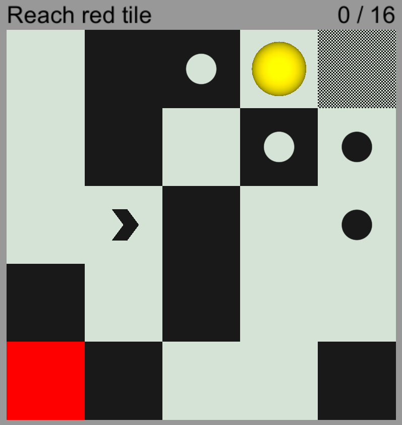

<h1>MazeGen</h1>
Maze generator that uses genetic algorithm. Made in Unity/C# (2021.3.9f1). 
 
Have fun :)
 
 

 
  
  
  
  

<h2> Download</h2>
<a href="https://olijo.itch.io/mazegen">game on itch.to</a>

<h2> Assets</h2>
Sounds from <a href="https://mixkit.co">mixkit.co</a>