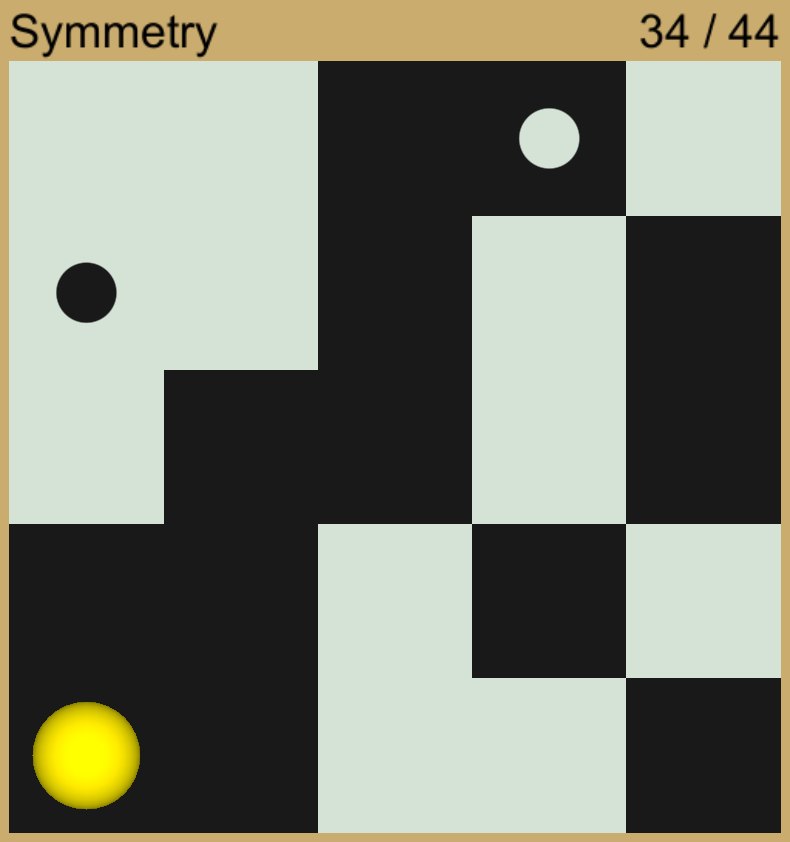
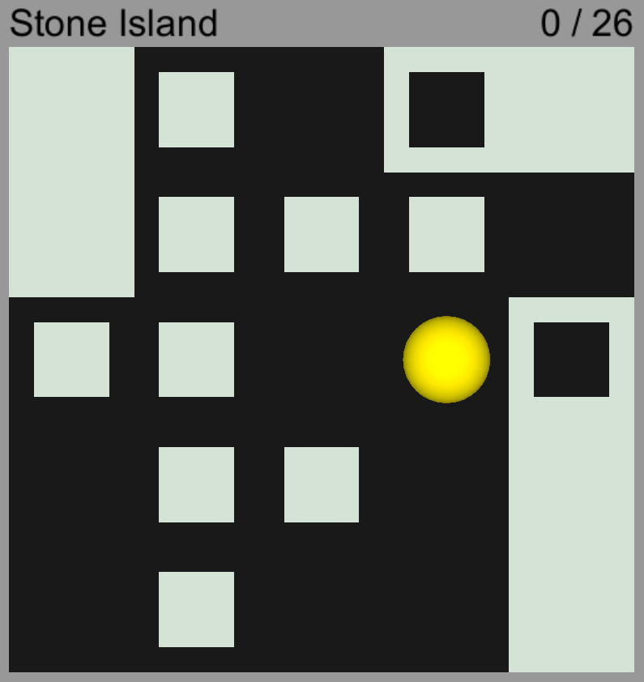
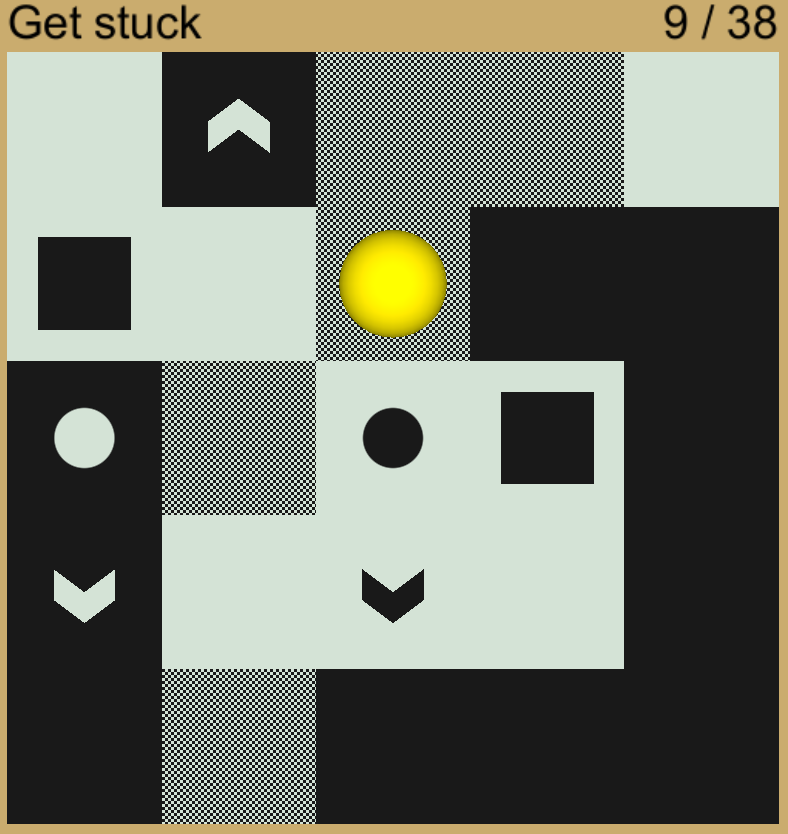

MazeGen 

<h1>MazeGen</h1>
Interactive maze generator using genetic algorithm. Made in Unity/C#.  

  
  
  
  

<h2>How it works</h2>
<h3>Choosing rules</h3>

The user selects a win condition and the types of tiles the maze will be composed of. Extra modifiers that change the behaviour of the tiles and the player can be selected.

<h3>Generator</h3>

First we generate a number of completely random mazes according to the rules inputed by the user. 
Than they are sorted by the number of steps needed to solve them.
 
 
Now new mazes are generated by picking 2 random mazes from the the previous ones to recombine them into a new one. Mazes with a longer solution path have a higher chance to be picked.Than they are mutated (slight random change). The whole list is sorted again, but now we remove half of the bottom of the list.
The process of generating new mazes by recombining old ones is repeated until one of the stopping conditions is met.
 
 
At the end, the maze with the longest solution path is presented to the user.

<h3>Clean up</h3>

After the generator is done we are left with a maze that still might include tiles that are not necessary. 
In order to only keep tiles we really need, we go over all tiles and try to replace them with a simpler tile and solve the Maze again. 
In case this new maze has the same fitness as the original one we keep the former one. We repeat this process as long as a change was made and display the cleaned up version to the user.

